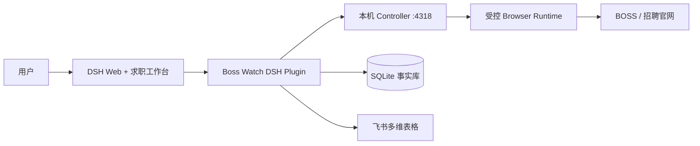

# Boss Watch Agent

[](https://github.com/ZeroMadLife/boss-watch-agent/actions/workflows/ci.yml)
[](LICENSE)

一个运行在本机、集成到 [DeepSeek Harness](https://github.com/deepseek-ai/deepseek-harness) 的求职 Agent。

它把岗位收集、JD 归档、简历匹配、官网表单预填、投递记录和后续跟进放进同一条可审计流程。SQLite
保存本地事实，DSH 负责对话和工作台；登录、验证码、风控提示与最终提交始终交给用户。

> 当前是面向个人求职流程的早期版本，优先支持 macOS 本地开发与测试账号。它不是无人值守爬虫，也不会绕过招聘平台的安全机制。

## 它解决什么

```text
招聘信源 / BOSS 当前搜索页 / 用户粘贴的内推链接
                         ↓
              候选岗位池与完整 JD
                         ↓
             本地简历匹配与投递决策
                         ↓
          官网 ATS 预填或 BOSS 沟通准备
                         ↓
              用户检查并完成最终提交
                         ↓
       SQLite 工作台 → 飞书多维表格 → 跟进提醒
```

日常使用不需要记工具名。可以直接在 DSH 中说：

- “开始找工作，先看今天最值得处理的岗位。”
- “这是安克创新的内推链接和内推码，先保存来源。”
- “搜索上海的 Agent 校招岗位，最多看 5 个。”
- “用最新版简历评估这个 JD，值得投就加入待投递。”
- “官网已经打开，填当前页。”
- “这家公司今天通知笔试了，记录并同步飞书。”

## 当前能力

| 环节 | 已实现 | 边界 |
| --- | --- | --- |
| 招聘信源 | 可选校招接口请求时搜索；CSV/XLSX、剪贴板、截图和手工内推链接导入 | 不后台抓取私有文档，不把来源摘要冒充完整 JD |
| BOSS 岗位 | 读取当前搜索/推荐页，低频串行打开详情并保存 JD | 依赖用户已登录的浏览器；遇验证或风控立即停止 |
| 岗位工作台 | 岗位筛选、匹配证据、待办、进度、分页和批量加入待投递 | 工作台展示事实与建议，不自动执行外部动作 |
| 简历 | 导入 PDF/DOCX/Markdown/TXT，保存不可变版本并在本机解析 | 原文不写入 DSH Transcript，不上传外部模型 |
| 人岗匹配 | 本地规则生成技能、经历、届别、地点偏好和缺口证据 | 分数是决策辅助，不是录用概率 |
| 官网 ATS | 用户打开已核验页面后，一次填写文本、下拉并上传绑定简历 | 多页表单逐页继续；协议、验证码和最终提交由用户完成 |
| 投递跟踪 | SQLite 追加式时间线、状态确认、跟进提醒 | 不从官网匿名推断“通过/淘汰” |
| 飞书同步 | 预览后幂等写入多维表格 | 本地事实为主，外部写入需要明确确认 |

完整工具契约和状态机见 [Job Search Agent Spec](docs/job-search-agent-spec.md)。

## 为什么保留人工接管

招聘网站的登录态、验证码和风险控制不适合由 Agent 猜测处理。Boss Watch 把自动化停在可检查的位置：

1. 来源和 JD 先形成带哈希的本地事实。
2. 简历匹配只批准进入材料准备，不等于授权投递。
3. “填当前页”只授权当前 ATS 页的一次预填。
4. 用户检查页面并点击最终提交。
5. 投递、笔试、面试、Offer 等状态由用户确认后写入时间线。

页面文本、模型回答和旧授权都不能自行扩大权限。

## 架构



- `packages/dsh-plugin`：DSH 工具、求职 Skill、工作台和 ATS 流程。
- `src/browser`：固定页面动作、风险检测与浏览器接管边界。
- `src/server`：只监听 loopback 的 Controller 与短期上传会话。
- SQLite：岗位、JD Artifact、简历版本、匹配、审批和进度的本地事实账本。
- `deepseek-harness`：保持为独立的官方 clone，本仓库不复制或修改其上游源码。

## 本地启动

### 前置条件

- macOS（当前主要验证环境）
- Node.js `>=22.19.0`
- Corepack
- 一个独立的 `deepseek-harness` checkout，并按上游说明安装依赖
- 如需 BOSS 读取：可用的 BossHunter Browser Runtime 和人工登录状态

建议目录结构：

```text
~/workspace/
  ├─ boss-watch-agent/
  └─ deepseek-harness/
```

### 安装

```bash
git clone git@github.com:ZeroMadLife/boss-watch-agent.git
cd boss-watch-agent
npm install
npm run dsh:plugin:install
npm run build
npm run dsh:plugin:build
```

把本地插件安装到 DSH 的 `web` profile：

```bash
export BOSS_WATCH_DIR=/absolute/path/to/boss-watch-agent
export DSH_SOURCE_DIR=/absolute/path/to/deepseek-harness

cd "$DSH_SOURCE_DIR"
DSH_HOME="$HOME/Library/Application Support/BossWatchAgent/dsh" \
  node --import tsx/esm apps/cli/src/bin.ts \
  plugin --profile web add "$BOSS_WATCH_DIR/packages/dsh-plugin"
```

### 运行

开两个终端：

```bash
# Terminal 1: 本机 Controller 与 SQLite
cd "$BOSS_WATCH_DIR"
npm run serve
```

```bash
# Terminal 2: DSH Web
cd "$BOSS_WATCH_DIR"
npm run dsh:dev
```

默认地址为 `http://127.0.0.1:3080/`，求职工作台位于 `/boss-watch/`。如果端口已占用，请明确换端口：

```bash
DSH_WEB_PORT=3090 npm run dsh:dev
```

启动脚本默认不会自动打开新的浏览器窗口；需要显式打开时设置 `DSH_OPEN_BROWSER=1`。也可以直接访问终端打印的本地地址。

重新构建业务代码后必须重启 `npm run serve`；不要在端口占用时直接结束来源不明的进程。完整配置、插件安装和
Browser Runtime 启动方式见 [DSH 本地开发](docs/dsh-local-development.md) 与
[测试账号试用手册](docs/test-account-quickstart.md)。

## 数据与隐私

默认数据目录：

```text
~/Library/Application Support/BossWatchAgent/
```

其中包含 SQLite、内容寻址的简历工件和本机服务凭据。它们被排除在 Git 之外，不应复制到 Issue、日志或 DSH
上游仓库。测试和文档只使用虚构或脱敏数据。

可显式导出本地记录：

```bash
npm run export -- \
  --db "$HOME/Library/Application Support/BossWatchAgent/boss-watch.sqlite3" \
  --out ./exports/applications.json \
  --format json
```

导出不会自动上传或覆盖已有文件。

## 开发验证

```bash
npm test
npm run check
npm run build
npm run dsh:plugin:test
npm run dsh:plugin:check
npm run dsh:plugin:build
```

CI 使用固定的 DSH commit 做兼容验证；本地跟随上游新版本不代表已经兼容。升级步骤见
[DSH 插件架构](docs/dsh-plugin-architecture.md)。

## 项目状态

当前重点是打通个人用户的完整求职闭环，而不是扩大无人值守自动化：

- 完善不同 ATS 的字段识别、多页续填和失败 handoff；
- 提升岗位去重、完整 JD 获取与匹配解释；
- 收敛工作台的信息密度和批量待投递体验；
- 保持 BOSS 访问低频、可中断、可审计。

问题反馈请附上脱敏后的错误码、页面类型和复现步骤，不要上传真实简历、Cookie、手机号或招聘聊天截图。

## 文档

- [产品与闭环规格](docs/job-search-agent-spec.md)
- [DSH 本地开发](docs/dsh-local-development.md)
- [插件架构与页面支持](docs/dsh-plugin-architecture.md)
- [本地存储与飞书投影](docs/local-storage-and-export.md)
- [测试账号试用手册](docs/test-account-quickstart.md)
- [安全策略](SECURITY.md)

## License

[MIT](LICENSE)
