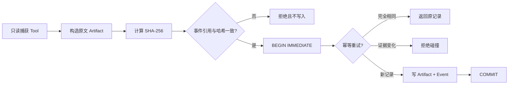
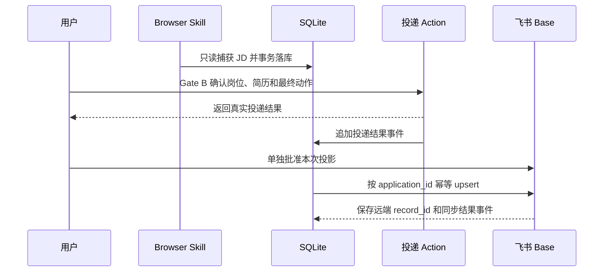

# 本地 SQLite、导出与飞书投影设计

## 1. 当前交付边界

本切片已经实现：

- 以 SQLite 保存投递事件、JD 原文、招聘方消息原文和面经；
- 原文 artifact 与对应事件在同一个事务内提交；
- 按投递维度校验幂等键，重复重试返回第一次结果，证据变化则拒绝覆盖；
- 用户主动导出全部投递或单个投递的 JSON/Markdown 文件。

本切片没有实现：

- 真实 BOSS 登录、页面读取或投递；
- 自动消息、自动发送简历、自动接受面试；
- 飞书写入或飞书双向同步；
- 多机器共享数据库或服务端任务队列。

因此，“有 SQLite Store”只代表本地事实库基础设施已经可用，不代表真实投递链路已经上线。

## 2. 为什么 SQLite 适合第一版

SQLite 是一个本地文件，不需要额外部署数据库服务，适合单用户桌面 Agent。事务、唯一约束和
WAL 足以支撑本地多个 Worker 各自连接同一个数据库文件。当前使用 Node 内置 `node:sqlite`，
不引入需要单独编译的原生依赖。

边界同样明确：SQLite 不负责 BOSS 任务调度，也不是大型秋招服务端队列。后续如果要承载多机器、
数千并发任务，应把任务队列与事实库拆开，使用 Redis/消息队列调度、服务端数据库持久化；本地
SQLite 继续作为个人可控副本或缓存。

## 3. 数据模型

### `application_artifacts`

| 字段 | 含义 |
| --- | --- |
| `artifact_id` | 原文工件稳定 ID |
| `application_id` | 所属投递 ID |
| `kind` | `job_description`、`recruiter_message` 或 `interview_note` |
| `content` | 完整原文 |
| `content_hash` | UTF-8 原文的 SHA-256 |
| `artifact_ref` | 事件持有的本地工件引用 |
| `created_at` | 工件捕获时间 |
| `metadata_json` | 结构化来源信息，不应包含 Cookie、Token 或密码 |

### `application_events`

| 字段 | 含义 |
| --- | --- |
| `event_id` | 全局事件 ID |
| `application_id` | 所属投递 ID |
| `sequence` | 单个投递内从 1 开始的顺序号 |
| `idempotency_key` | 单个投递内唯一的业务重试键 |
| `trace_id` | 一次 Agent/Tool 执行链的追踪 ID |
| `event_type` | JD 捕获、消息捕获、面经记录或状态提议 |
| `event_json` | 完整版本化事件 |
| `artifact_id` | 原文事件对应的 artifact；状态提议为空 |

关键约束是 `UNIQUE(application_id, idempotency_key)` 和
`UNIQUE(application_id, sequence)`。同一个 BOSS 岗位来源键可以在两个不同投递中复用，但不能在
同一个投递内指向两份不同证据。

## 4. 写入链路与失败语义



SQLite 开启外键、WAL 和 5 秒 `busy_timeout`。`BEGIN IMMEDIATE` 将同一数据库内的写入串行化，避免
两个 Worker 为同一投递生成相同顺序号。超出等待时间会明确失败，由上层队列使用相同幂等键重试，
不能静默丢弃或改写证据。

## 5. 用户导出

构建后可以使用二进制入口：

```bash
npm run build
npm link
boss-watch export --db ./data/applications.sqlite3 --out ./exports/applications.json --format json
```

也可以直接通过 npm：

```bash
npm run export -- --db ./data/applications.sqlite3 --out ./exports/applications.md --format markdown
npm run export -- --db ./data/applications.sqlite3 --out ./exports/application-001.json --format json --application application-001
```

导出规则：

- 导出必须由用户发起，不自动上传；
- JSON 保留应用分组、事件、原文、哈希、ID 和时间，适合迁移；
- Markdown 保留相同证据，适合人工阅读和归档；
- 默认不覆盖已有文件，显式 `--force` 才覆盖；
- 导出文件权限默认为仅当前用户可读写；
- 导出可能包含招聘对话和面经中的个人信息，用户应自行决定保存位置和分享范围。

## 6. 后续投递到飞书的正确链路

飞书多维表格是可查询的投影，不是本地事实源。计划链路如下：



飞书第一版建议只投影：`application_id`、公司、岗位、JD URL、JD 原文、JD SHA-256、当前状态、
最近事件时间和本地 `trace_id`。招聘方消息和面经可能包含个人信息，默认不自动同步。

要走通这条链，下一切片还需要：

1. 只读 Browser Adapter 调用 `appendWithArtifact` 保存 Fresh JD；
2. Gate B 后执行单一投递 Action，并新增明确的投递结果事件契约；
3. 独立的 `sync_feishu` Tool 使用 `application_id` 幂等 upsert；
4. 飞书 Tool 继续标记为 `external_side_effect`，不能被页面文本或模型输出自行授权。
