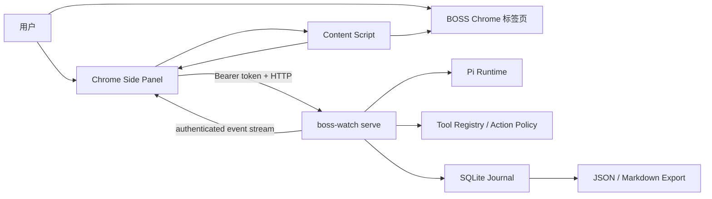
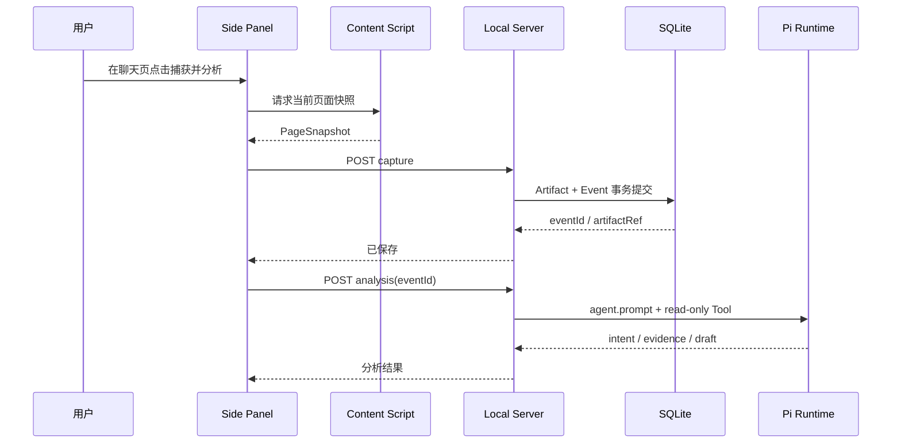

# Boss Watch 测试账号 Side Panel 设计

日期：2026-08-14
状态：V1 本地实现完成，待授权测试账号验收

## 1. 目标

交付一个可在用户已授权的 BOSS 测试账号上使用的本地版本：用户在 Chrome 中人工登录和浏览，
Chrome 原生 Side Panel 识别当前岗位页或聊天页，按用户指令把可审计原文保存到 SQLite；聊天证据
可继续调用本地 Pi Runtime 或明确标识的 Baseline 分析。

第一版的完整成功路径是：

```text
人工登录 BOSS
  -> 手动启动 boss-watch serve
  -> Chrome Side Panel 与本地服务配对
  -> 用户打开岗位页或聊天页
  -> 用户点击捕获
  -> 原文与事件事务落库
  -> 聊天证据由 Pi 或明确标识的确定性 Baseline 返回分析
  -> Side Panel 展示证据、结果和保存状态
  -> 用户可通过 CLI 导出 JSON / Markdown
```

## 2. 已确认决策

1. 浏览器入口使用 Chrome 原生 Side Panel，不向 BOSS 页面注入可见抽屉。
2. Driver 使用 Extension-first Hybrid：第一版只读用户当前标签页，后续再增加 ego-lite 或
   Patchright CDP Adapter。
3. Side Panel 第一屏以当前页面任务为中心；完整投递统计以后进入独立 Web Dashboard。
4. `boss-watch serve` 是常驻本地进程，默认监听 `127.0.0.1:4318`。
5. 第一版由用户手动启动服务，不安装 macOS LaunchAgent。
6. 不自动发送消息、简历、跟进、面试确认或投递动作。

## 3. 当前证据

- Pi 集成测试已经证明 `agent.prompt()` 可完成一次只读 Tool 调用，外部 Tool 会在 `execute()` 前
  被 Policy 拦截；当前测试使用 Scripted Mock Model，不代表真实模型 Provider 已接通。
- SQLite 已支持 artifact 与事件同事务写入、应用级幂等、哈希校验和 JSON/Markdown 导出。
- BossHunter 源码显示其主要路径是 Python 调用本地 CDP Proxy，再由 Proxy 执行
  `Runtime.evaluate`、`Page.navigate` 和输入事件；岗位与聊天数据主要从渲染后的 DOM 提取，
  不是直接调用 BOSS 业务后台 API。
- ego-lite 提供隔离 Task Space、语义快照、截图、DOM/CDP 操作和人工控制权交接，适合作为后续
  Driver，但不作为第一版 Side Panel 的运行前提。

## 4. 系统架构



Side Panel 和 Content Script 属于扩展；Pi、模型 Provider、Tool Policy、SQLite 和导出属于本地
Node 进程。岗位页第一版只捕获 JD；聊天页保存最新可见招聘方消息后才允许分析。扩展不包含模型
密钥，不直接打开 SQLite，也不把页面原文上传到第三方服务。

### 4.1 `boss-watch serve`

新增 CLI 命令：

```bash
boss-watch serve --port 4318 --data-dir "$HOME/Library/Application Support/BossWatchAgent"
```

职责：

- 初始化 SQLite、Pi Runtime、Tool Registry 和模型 Adapter；
- 提供版本化 localhost API 和 SSE；
- 生成短期配对码并管理扩展客户端令牌；
- 输出结构化运行日志，但不打印 JD、聊天原文、Cookie、Token 或模型密钥；
- 收到终止信号后停止接收请求、关闭事件流和 SQLite。

固定端口便于扩展连接。端口被占用时启动失败并给出占用诊断，不随机切换端口。服务仅绑定
`127.0.0.1`，不监听局域网地址。

### 4.2 Chrome 扩展

扩展使用 Manifest V3、TypeScript、Vue 3 和 Vite。第一版只申请完成当前任务所需的权限：

- `sidePanel`：显示原生侧栏；
- `activeTab`、`scripting`：在用户当前激活的 BOSS 标签页执行只读捕获；
- `storage`：保存本机配对令牌和非敏感 UI 偏好；
- `https://www.zhipin.com/*` 与 `http://127.0.0.1:4318/*` 的最小 host permission。

不申请 `cookies` 权限，不读取 Cookie、Local Storage、密码输入框、网络请求头或 Chrome Profile
文件。用户点击扩展图标后打开 Side Panel；本地 CLI 不尝试绕过 Chrome 的用户手势要求。

### 4.3 Page Adapter

Content Script 只针对受支持页面返回结构化 `PageSnapshot`：

```text
captureId
capturedAt
sourceUrl
pageKind: job_detail | conversation | unsupported | human_required
pageRevision
visible evidence fields
```

岗位页只读取岗位容器中的外部岗位 ID、公司、岗位、JD、URL 和可见元数据。聊天页只读取当前选中
会话中最新一条可见且已加载的招聘方消息，不滚动加载历史，不扫描其他联系人。原文来自明确容器的
`innerText`，不发送整页 HTML、脚本、隐藏输入或浏览器存储。

页面内容按不可信输入处理。服务端重新校验类型、长度、URL host、时间和稳定 ID；单次 payload
上限为 512 KiB。`pageRevision` 由规范化可见字段计算，用于拒绝过期分析和重复保存。

### 4.4 Application 关联

首次捕获岗位时，本地生成 `applicationId`，并以 `(platform, externalJobId)` 建立唯一映射。
聊天页若能从当前页面解析出岗位 ID，则自动关联；无法可靠解析时，Side Panel 要求用户选择一个
现有投递，不根据公司名或模型推断关联关系。

## 5. API 与数据流

第一版 API：

| Method | Path | 作用 |
| --- | --- | --- |
| `GET` | `/api/v1/health` | 返回服务、数据库和 Pi 模式，不返回秘密 |
| `POST` | `/api/v1/pair` | 使用短期配对码换取扩展客户端令牌 |
| `POST` | `/api/v1/captures/job` | 校验并事务保存一份 JD artifact/event |
| `POST` | `/api/v1/captures/conversation` | 校验并事务保存当前会话最新可见招聘方消息 |
| `POST` | `/api/v1/analyses/conversation` | 对已保存的会话证据运行分析 |
| `GET` | `/api/v1/applications/:id` | 读取一个投递的事件和 artifact 摘要 |
| `GET` | `/api/v1/artifacts/:id` | 经认证按需读取一个原文 artifact |
| `GET` | `/api/v1/events` | 通过认证的 `fetch` 流返回 SSE 格式状态变化 |

聊天页的“捕获并分析”是 UI 编排，不是一个多副作用 Tool：先调用捕获 API，确认原文已经落库，
再以返回的 artifact/event ID 调用分析 API。模型失败不会回滚已经确认的原始证据。



## 6. Pi 与模型模式

服务始终装配现有 Pi Agent、Tool Registry 和 Action Policy，同时公开真实分析模式：

- `pi_ready`：已配置真实 Model/Stream Provider，可以运行 Pi 分析；
- `baseline_ready`：未配置真实模型，用户可显式运行现有确定性规则 Baseline；
- `capture_only`：分析组件初始化失败，只允许捕获、落库、读取和导出。

分析请求显式携带 `mode: pi | baseline`。Pi 失败时不静默切换 Baseline；用户可以另行点击规则分析。
UI 必须显示实际模式，不能把 Baseline 冒充 Pi。模型密钥只从服务进程环境或后续的 Keychain
Adapter 读取，不经过扩展、SQLite、日志或 API 响应。

## 7. Side Panel 信息架构

底部导航固定为：`当前`、`时间线`、`设置`。

### `当前`

- 顶部显示本地服务、页面类型和 Pi 模式；
- 岗位页显示公司、岗位和“捕获当前岗位”；
- 聊天页显示当前招聘方、最新证据和“捕获并分析”；
- 捕获后显示 SHA-256 已校验、保存时间和 artifact 引用；
- 分析后显示意图、精确原文证据和草稿；
- 草稿只允许复制，不提供发送按钮。

### `时间线`

显示当前 `applicationId` 的事件顺序、证据哈希和失败原因。原文默认折叠，用户点击后才读取。

### `设置`

显示服务地址、配对状态、数据库位置、Pi 模式和版本。第一版不包含自启动开关和真实账号凭据。

## 8. 配对与本地安全

1. 服务首次启动生成一次性配对码，有效期 5 分钟，最多尝试 5 次。
2. Side Panel 由用户输入配对码；服务签发随机客户端令牌并绑定扩展 ID。
3. 客户端令牌保存在 `chrome.storage.local`；服务端只保存令牌哈希。
4. 除健康检查和配对外，API 必须携带 Bearer token。
5. 服务校验 `Origin: chrome-extension://<bound-id>`，拒绝普通网页发起的 localhost 请求。
6. 事件流使用带 Authorization header 的 `fetch` + `ReadableStream`，不使用无法加认证头的原生
   `EventSource`；令牌失效时面板回到配对状态。

配对只授权访问本地 Boss Watch API，不授权任何 BOSS 外部动作。

## 9. 页面状态与错误处理

| 状态 | Side Panel 行为 |
| --- | --- |
| 本地服务未启动 | 显示连接失败和可复制启动命令 |
| 尚未配对或令牌失效 | 显示配对输入，不读取页面原文 |
| 非 BOSS 页面 | 显示不支持当前页面，不执行捕获 |
| 登录、验证码、风险提示 | 标记 `human_required`，停止捕获并交给用户 |
| 页面结构无法识别 | 返回 `page_adapter_mismatch`，保留 URL/版本诊断，不保存整页内容 |
| 内容与上次哈希一致 | 返回已有事件，不重复写入或调用模型 |
| SQLite busy 超时 | 返回可重试错误，重试沿用相同幂等键 |
| 模型未配置 | 已保存证据，显示 `baseline_ready` 和明确的规则分析入口 |
| 模型超时或失败 | 已保存证据，显示稳定错误和手动重试入口 |
| 页面在分析前变化 | 拒绝旧 revision，要求重新捕获 |

## 10. 平台风险边界

第一版不会自动打开搜索页、翻页、滚动、点击、输入或轮询 BOSS 页面。用户的正常导航产生页面内容，
扩展只在用户点击后读取当前可见证据。因此第一版不需要生产 Playwright 或 ego-lite Driver。

允许的风险控制包括：本地速率限制、同内容去重、任务预算、指数退避、熔断、Fresh Capture 和人工接管。
不实现指纹伪装、验证码识别/绕过、代理轮换、登录态窃取、隐藏自动化或规避平台限制。

后续增加 Driver 时必须实现统一契约：`capture -> one action decision -> fresh capture -> verify`，并分别
评审 ego-lite Task Space 和 Patchright CDP 的账号所有权、恢复、停止条件和请求预算。

## 11. 实现边界

第一版包含：

- `boss-watch serve` 本地 API、SSE、配对和优雅关闭；
- Chrome MV3 Side Panel、Content Script 和三页 UI；
- 岗位页、当前聊天页最新招聘方消息 Page Adapter；
- SQLite 捕获 Tool 装配；
- Pi Provider 状态和会话分析入口；
- 本地 Fixture、API、扩展和测试账号手工验收。

第一版不包含：

- 自动投递、发送消息、上传简历或接受面试；
- BossHunter 批量任务迁移；
- ego-lite/Patchright 生产 Driver；
- 飞书同步；
- 独立全尺寸 Web Dashboard；
- macOS LaunchAgent、自启动或桌面安装包。

## 12. 验证与验收

### 自动测试

- Page Adapter 使用脱敏 HTML Fixture 覆盖岗位、聊天、未支持、登录和结构漂移；
- API 使用临时端口与临时 SQLite 覆盖配对、认证、payload 限制、幂等和错误映射；
- Pi 使用 Scripted Stream 覆盖分析成功、模型失败和外部 Tool 拦截；
- 扩展使用本地 Fixture 页面测试 Side Panel 的断线、配对、捕获、分析和错误状态；
- Playwright 仅作为扩展 E2E 测试工具，不作为第一版生产浏览器 Driver；
- 全量运行 TypeScript、Biome、构建和现有回归测试。

### 授权测试账号验收

1. 用户人工登录测试账号并处理全部验证；
2. 手动启动 `boss-watch serve`，加载 unpacked 扩展并完成配对；
3. 在一份测试岗位上捕获 JD，确认原文、URL、哈希和 SQLite 重开一致；
4. 在一条脱敏测试会话中捕获最新可见招聘方消息，确认精确 Evidence 和草稿；
5. 刷新页面、切换标签页和重启服务，确认 Side Panel 状态可恢复；
6. 触发未支持页面、服务断开和模型不可用，确认没有外部动作或证据丢失；
7. 手动导出单个投递 JSON/Markdown，确认内容与本地事实库一致。

真实 Cookie、手机号、简历、聊天导出、截图和测试数据库不得进入 Git。真实账号验收结果只记录脱敏
状态、错误码、时延和哈希，不记录原文。

## 13. 后续扩展顺序

1. 根据 Side Panel 使用反馈调整当前页、时间线和设置页；
2. 增加独立 Web Dashboard 汇总投递进度；
3. 增加 ego-lite 只读 Driver 与人工 Handoff；
4. 评估 Patchright CDP 批量只读采集，不复用 BossHunter 发送链路；
5. 单独设计 Gate B 投递 Action 和飞书幂等投影。
